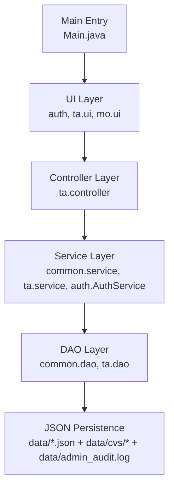
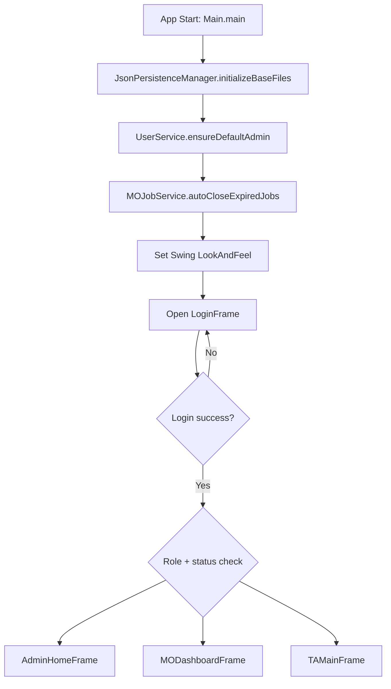
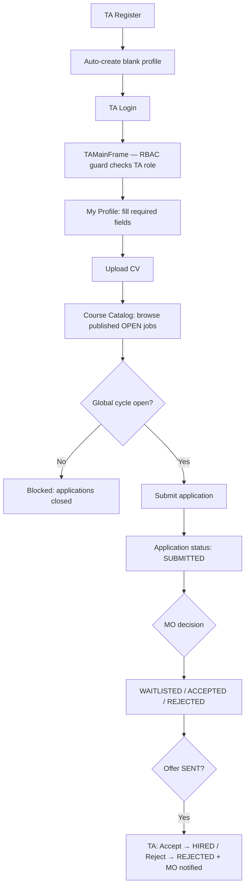
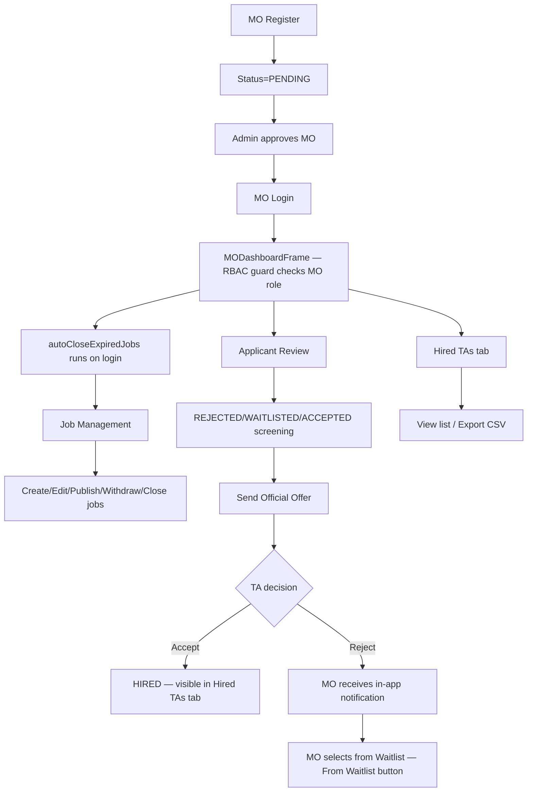
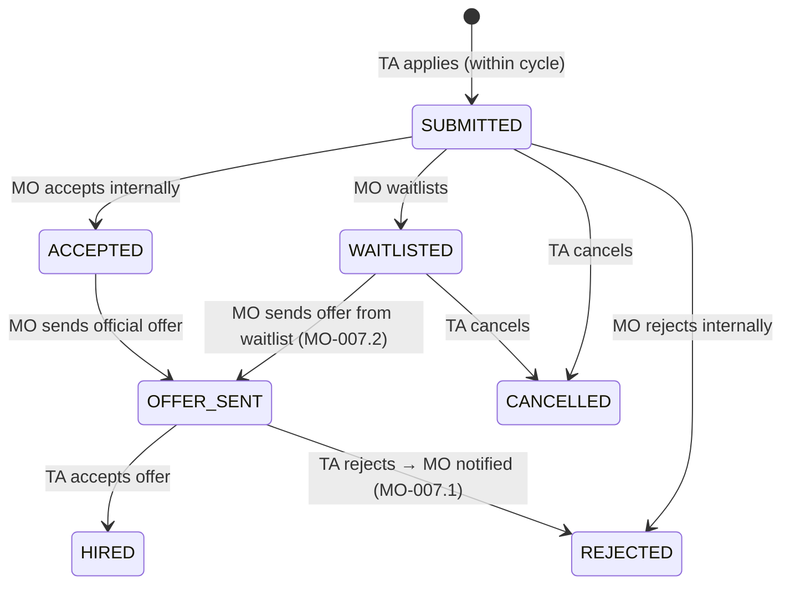
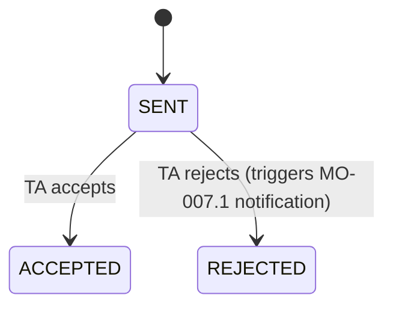
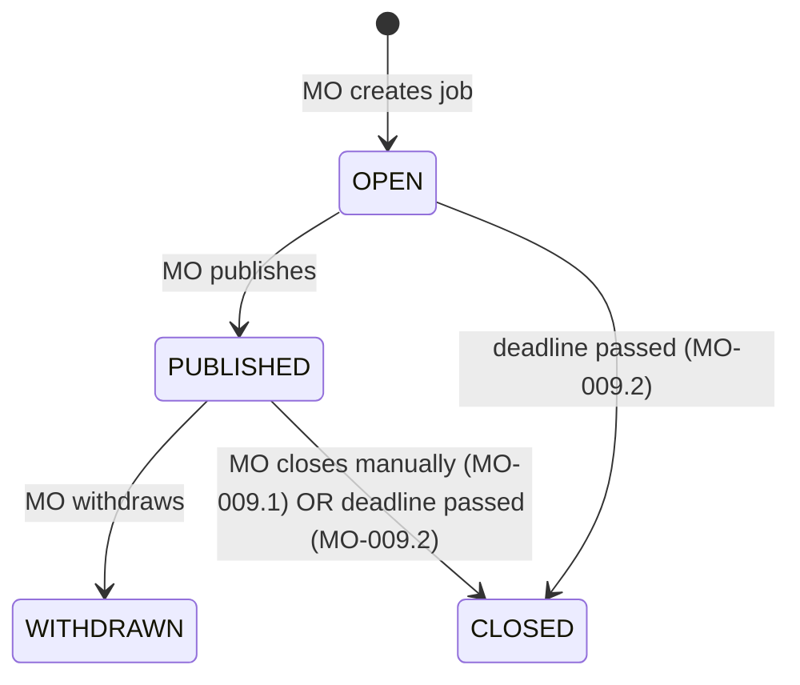

# TA Recruitment System — Project Architecture and Runtime Logic (Iteration 3)

> **Last updated:** Iteration 3 (Sprint 3)  
> Covers all features through Iteration 2 + the complete Iteration 3 feature set:
> MO-007 · MO-008 · MO-009 · ADM-001~004 · SYS-001

---

## 1. System Architecture

### 1.1 Layered Structure



### 1.2 Package Responsibilities

| Package | Responsibility |
|---|---|
| `auth` | Login, registration, role-based routing, AdminHomeFrame |
| `ta.ui` + `ta.controller` + `ta.service` + `ta.dao` | TA workflows: profile, CV, applications, offer decisions |
| `mo.ui` + `common.service` | MO workflows: job management, applicant review, offer dispatch, waitlist, hired-TA list, CSV export |
| `common.service` + `common.dao` | Shared services: users, jobs, offers, notifications, system config, RBAC |
| `common.entity` + `ta.entity` | Domain objects and state models |
| `common.util` | Utilities: `GsonUtils`, `CsvExportUtil`, `AdminAuditLogger` |

### 1.3 Data Persistence Layout

All business data lives under `data/` (created automatically by `JsonPersistenceManager`):

| File | Purpose | Format |
|---|---|---|
| `users.json` | All user accounts (TA, MO, Admin) | JSON array of `PersistedUser` |
| `ta_profiles.json` | TA profile details | JSON array of `TAProfile` |
| `mo_jobs.json` | MO job postings | JSON array of `MOJob` |
| `ta_applications.json` | TA applications | JSON array of `TAApplication` |
| `ta_cvs.json` | CV metadata | JSON array of `CVInfo` |
| `mo_offers.json` | MO→TA offers | JSON array of `MOOffer` |
| `notifications.json` | In-app notifications | JSON array of `NotificationMessage` |
| `system_config.json` | Global recruitment cycle | Single `SystemConfig` object |
| `permissions.json` | RBAC role-access matrix (SYS-001) | Single object with `roleAccess` map |
| `admin_audit.log` | Admin operation audit trail (ADM-004.2) | Append-only plain text, one line per action |
| `cvs/` | Uploaded CV files | Binary files |

---

## 2. Startup and Global Runtime Flow



**Startup side effects:**
- `ensureDefaultAdmin()` — seeds `admin@test.com / admin123` if entry is missing from `users.json`.
- `autoCloseExpiredJobs()` — scans all OPEN/PUBLISHED jobs; closes those whose deadline is before today. Also re-runs when MO logs in.
- `PermissionService` lazy-loads `data/permissions.json` on first `hasAccess()` call, falling back to hardcoded defaults if file is absent.

---

## 3. Registration and Login Logic

### 3.1 Registration (`RegisterFrame` → `AuthService.register`)

```mermaid
sequenceDiagram
    participant UI as RegisterFrame
    participant AS as AuthService
    participant US as UserService
    participant TPS as TAProfileService
    participant DAO as UserFileDAO/TAProfileDAO

    UI->>AS: register(email, password, role)
    AS->>AS: validate email domain (@qmul.ac.uk or @bupt.edu.cn)
    AS->>AS: validate password length ≥ 6
    AS->>US: register(...)
    US->>DAO: save user to users.json
    AS->>TPS: initializeProfile(...) (TA only)
    TPS->>DAO: save blank TA profile to ta_profiles.json
    AS-->>UI: User object; LoginFrame opens with role tab pre-selected
```

Key behavior:
- Accepted domains: `@qmul.ac.uk` and `@bupt.edu.cn`.
- MO accounts start as `PENDING` — must be approved by Admin before login.
- TA and Admin accounts start as `ACTIVE`.
- After registration, `LoginFrame` opens with the registered role's tab pre-selected.

### 3.2 Login (`LoginFrame` → `AuthService.login`)

1. Role tab must match the account's actual role.
2. `DISABLED` accounts are blocked.
3. Admin accounts additionally require `isStrictAdmin` (email = `admin@test.com`, status = `ACTIVE`).
4. `PermissionService.hasAccess` determines routing.
5. Each portal (TAMainFrame, MODashboardFrame) now also carries a defensive role guard in its own constructor.

---

## 4. TA Role Runtime Logic

### 4.1 TA End-to-End Flow



### 4.2 TA Application Constraints (`TAApplicationService.submitApplication`)

1. Global recruitment cycle must be open (`SystemConfigService.isWithinApplicationCycle`). *(New in Iteration 3)*
2. Profile must be complete.
3. At least one CV must exist and be selected.
4. Job must be `PUBLISHED` (CLOSED jobs are invisible to TAs).
5. No duplicate active application for the same job.
6. Cannot reapply after rejection.
7. Max 3 active applications at a time.

### 4.3 Call Chain — TA Apply

```
TACourseCatalogPanel
  → TAApplicationController.submitApplicationWithFeedback
  → TAApplicationService.submitApplication
      ├── SystemConfigService.isWithinApplicationCycle  [NEW Iteration 3]
      ├── TAProfileService.isProfileComplete  → ta_profiles.json
      ├── CVService.getCVById                → ta_cvs.json
      ├── MOJobService.getPublishedJob       → mo_jobs.json
      └── TAApplicationDAO.save             → ta_applications.json
```

---

## 5. MO Role Runtime Logic

### 5.1 MO End-to-End Flow



### 5.2 MO-007.1 — TA Rejection Notification to MO

**Trigger:** TA clicks "Reject Offer" in `TAApplicationsPanel`.

**Call chain:**
```
TAOfferController.rejectOffer
  → MOOfferService.rejectOffer(offerId)
      ├── MOOffer.status = "REJECTED"
      ├── MOOffer.respondedAt = now()
      ├── MOOfferDAO.save              → mo_offers.json
      └── NotificationService.notifyUser(moUserId, MO, title, content, OFFER_REJECTED)
              └── NotificationDAO.save → notifications.json
```

**Notification content includes:**
- Course code + title (from `MOJobDAO`)
- TA full name (from `TAProfileDAO` / fallback to email)
- Rejection timestamp
- Hint: "You may select a replacement from the waitlist."

**Data structure (`notifications.json` entry):**
```json
{
  "notificationId": 5001,
  "recipientUserId": 100002,
  "recipientRole": "MO",
  "title": "[Offer Rejected] EBU6304 — Teaching Assistant",
  "content": "TA Jane Doe rejected your offer at 2026-04-16 14:22. You may select a replacement from the waitlist.",
  "type": "OFFER_REJECTED",
  "read": false,
  "createdAt": "2026-04-16T14:22:05"
}
```

### 5.3 MO-007.2 — One-Click Waitlist Selection

**UI Entry:** "From Waitlist" button in `MOApplicantReviewPanel`.

**Call chain:**
```
MOApplicantReviewPanel.showWaitlistDialog(referenceApp)
  → TAApplicationService.listWaitlistedByJobId(jobId)
      └── TAApplicationDAO.findAll → ta_applications.json (filter WAITLISTED, sort by appliedAt ASC)
  [MO selects candidate in dialog]
  → sendOfferFromWaitlist(chosenApp, job)
      ├── MOOfferService.sendOffer(offer)   → mo_offers.json
      └── TAApplicationDAO.save (status=OFFER_SENT) → ta_applications.json
```

**Sorting:** candidates sorted by `appliedAt` ascending (longest-waiting shown first).

### 5.4 MO-008.1 — View Hired TAs (`MOHiredTAsPanel`)

**Data sources (all loaded once before loop to avoid O(n²)):**

| Data | Source file |
|---|---|
| Job details | `mo_jobs.json` via `MOJobService.listAll()` → `Map<Long,MOJob>` |
| Applications with status `HIRED` | `ta_applications.json` |
| TA profile (name, major, year, phone) | `ta_profiles.json` via `TAProfileDAO` |
| Acceptance timestamp (`respondedAt`) | `mo_offers.json` where `status=ACCEPTED` |
| Fallback email | `users.json` via `UserService.getUserById` |

**Table columns:** TA Name · Major · Year · Phone · Email · Course · Hired At

### 5.5 MO-008.2 — Export Hired TAs to CSV

**Trigger:** "Export CSV" button in `MOHiredTAsPanel`.

**Call chain:**
```
MOHiredTAsPanel.exportToCsv()
  → JFileChooser (user picks path)
  → CsvExportUtil.exportRows(path, headers, rows)
      └── writes UTF-8 with BOM → *.csv (Excel-compatible)
```

**CSV columns:** Course Name · TA Name · Student ID / Email · Phone · Hired Date

### 5.6 MO-009.1 — Manual Close Recruitment

**UI Entry:** "Close Recruitment" button in `MOJobManagementPanel`.

**Call chain:**
```
MOJobManagementPanel.closeSelectedJob()
  → MOJobService.closeJob(jobId)
      ├── validates: not already CLOSED or WITHDRAWN
      ├── MOJob.status = "CLOSED"
      └── MOJobDAO.save → mo_jobs.json
```

**Effect on TAs:** `MOJobService.listPublishedJobs()` filters to OPEN/PUBLISHED only — CLOSED jobs become invisible to TAs immediately.

### 5.7 MO-009.2 — Auto-Close Expired Jobs

**Trigger points:** (1) App startup in `Main.initializeJsonStorage()`; (2) MO login in `MODashboardFrame.initUI()`.

**Call chain:**
```
MOJobService.autoCloseExpiredJobs()
  → for each OPEN/PUBLISHED job:
      ├── extractDeadline(job)    [parses deadline string]
      ├── if deadline.isBefore(LocalDate.now()):
      │     MOJob.status = "CLOSED"
      │     MOJobDAO.save → mo_jobs.json
      └── returns count of newly closed jobs
```

**Job status values:** `OPEN` · `PUBLISHED` · `WITHDRAWN` · `CLOSED`

---

## 6. Admin Role Runtime Logic

### 6.1 Admin Access Rule (ADM-001)

- Only `admin@test.com` with role `ADMIN` and status `ACTIVE` passes `isStrictAdmin`.
- `ensureDefaultAdmin()` is called at startup to seed this account if `data/users.json` is ever deleted.  
  Default credentials: **email** `admin@test.com` / **password** `admin123`.
- All three portals now have their own constructor-level role guard (defense-in-depth):
  - `AdminHomeFrame` — `isStrictAdmin` check
  - `MODashboardFrame` — `PermissionService.hasAccess(role, MO)`
  - `TAMainFrame` — `PermissionService.hasAccess(role, TA)`

### 6.2 Admin Portal (`AdminHomeFrame`) — Three Tabs

#### Tab 1: MO Account Approval (ADM-004.1 / ADM-004.2)

| Button | Action | Persisted to |
|---|---|---|
| Approve MO | `PENDING → ACTIVE` via `UserService.approveMoAccount` | `users.json` |
| Disable Account | `ANY → DISABLED` via `UserService.disableAccount` | `users.json` |
| Reactivate Account | `DISABLED → ACTIVE` | `users.json` |
| Reset Password | `UserService.resetPasswordByAdmin` (SHA-256 hash) | `users.json` |

Every action is appended to `data/admin_audit.log`:
```
[2026-04-16 14:23:01]  ADMIN=admin@test.com        ACTION=APPROVE_MO              TARGET=mo@test.com
```

**Audit log format:** `[YYYY-MM-DD HH:mm:ss]  ADMIN=<email>  ACTION=<verb>  TARGET=<email/label>`

#### Tab 2: System Data (ADM-002.1 / ADM-002.2)

Datasets available in dropdown:

| Dataset | DAO used | CSV export method |
|---|---|---|
| Users | `UserService.listAllUsers()` | `CsvExportUtil.exportUsers` |
| TA Profiles | `TAProfileDAO.findAll()` | `CsvExportUtil.exportObjects` |
| Jobs | `MOJobDAO.findAll()` | `CsvExportUtil.exportObjects` |
| Applications | `TAApplicationDAO.findAll()` | `CsvExportUtil.exportObjects` |
| CV Infos | `CVDao.findAll()` | `CsvExportUtil.exportObjects` |
| Offers | `MOOfferDAO.findAll()` | `CsvExportUtil.exportObjects` |
| Notifications | `NotificationDAO.findAll()` | `CsvExportUtil.exportObjects` |

CSV files written to `exports/` directory. Export action is also logged to `admin_audit.log`.

#### Tab 3: Application Cycle (ADM-003)

**Call chain:**
```
AdminHomeFrame.saveApplicationCycle()
  → SystemConfigService.updateApplicationCycle(start, end, adminEmail)
      └── JsonPersistenceManager.writeObject → system_config.json
```

**system_config.json structure:**
```json
{
  "applicationStart": "2026-04-01T00:00:00",
  "applicationEnd":   "2026-05-24T23:59:59",
  "updatedAt":        "2026-04-16T10:00:00",
  "updatedBy":        "admin@test.com"
}
```

**Enforcement points:**
1. `TAApplicationService.submitApplication` — throws `IllegalStateException` if current time is outside cycle.
2. `MOJobService` — validates job deadline falls within cycle on publish.

---

## 7. SYS-001 Role-Based Access Control (RBAC)

### 7.1 Permission Matrix

Stored in `data/permissions.json` and loaded lazily by `PermissionService`:

```json
{
  "roleAccess": {
    "ADMIN": ["ADMIN", "MO", "TA"],
    "MO":    ["MO"],
    "TA":    ["TA"]
  }
}
```

- If the file is missing or malformed, identical hardcoded defaults are used.
- Call `PermissionService.reload()` to re-read without restart.

### 7.2 Enforcement Layers (defense-in-depth)

| Layer | Mechanism | Where |
|---|---|---|
| L1 — Login gate | Role tab must match account role | `LoginFrame` |
| L2 — Account status | DISABLED accounts blocked | `LoginFrame` |
| L3 — Admin strict | Only `admin@test.com` reaches Admin portal | `LoginFrame` + `AdminHomeFrame` |
| L4 — Portal guard | Each portal checks role via `PermissionService.hasAccess` | `TAMainFrame`, `MODashboardFrame` constructors |
| L5 — Cycle guard | TA cannot submit outside configured window | `TAApplicationService.submitApplication` |

### 7.3 Call Chain — Access Check

```
LoginFrame (on Sign In)
  → AuthService.login        → users.json
  → role tab mismatch check
  → isStrictAdmin check (ADMIN only)
  → PermissionService.hasAccess(userRole, targetRole)
      └── loads data/permissions.json (once, cached)
  → route to correct portal frame
  → portal constructor: PermissionService.hasAccess (2nd guard)
```

---

## 8. Core State Transitions

### 8.1 Application Status



### 8.2 Offer Status



### 8.3 Job Status



---

## 9. Key Runtime Call Chains

### 9.1 Authentication Chain
```
LoginFrame → AuthService → UserService → UserFileDAO → users.json
```

### 9.2 TA Apply Chain (Iteration 3 updated)
```
TACourseCatalogPanel
  → TAApplicationController
  → TAApplicationService.submitApplication
      ├── [NEW] SystemConfigService.isWithinApplicationCycle
      ├── TAProfileService     → ta_profiles.json
      ├── CVService            → ta_cvs.json
      ├── MOJobService         → mo_jobs.json
      └── TAApplicationDAO     → ta_applications.json
```

### 9.3 MO Send Offer Chain
```
MOApplicantReviewPanel → MOOfferService.sendOffer → MOOfferDAO → mo_offers.json
                      → NotificationService       → notifications.json
```

### 9.4 MO Offer Rejection → Notify MO (MO-007.1)
```
TAOfferController.rejectOffer
  → MOOfferService.rejectOffer
      ├── MOOfferDAO.save       → mo_offers.json
      ├── resolveTaName         ← TAProfileDAO / UserService
      ├── resolveCourseLabel    ← MOJobDAO
      └── NotificationService.notifyUser(moUserId)  → notifications.json
```

### 9.5 MO Waitlist → Offer (MO-007.2)
```
MOApplicantReviewPanel.showWaitlistDialog
  → TAApplicationService.listWaitlistedByJobId  → ta_applications.json
  → sendOfferFromWaitlist
      ├── MOOfferService.sendOffer              → mo_offers.json
      └── TAApplicationDAO.save (OFFER_SENT)    → ta_applications.json
```

### 9.6 Admin Config Chain
```
AdminHomeFrame → SystemConfigService → system_config.json
MOJobService validates deadline against cycle on publish/post
TAApplicationService checks cycle on submit
```

### 9.7 RBAC Permission Check
```
PermissionService.hasAccess(userRole, targetRole)
  → loads data/permissions.json (lazy, cached)
  → returns boolean from roleAccess matrix
```

### 9.8 Auto-Close Expired Jobs (MO-009.2)
```
Main.initializeJsonStorage() / MODashboardFrame.initUI()
  → MOJobService.autoCloseExpiredJobs()
      → for each OPEN/PUBLISHED job: extractDeadline
      → if deadline < today: MOJob.status=CLOSED, MOJobDAO.save → mo_jobs.json
```

### 9.9 Admin Audit Log (ADM-004.2)
```
AdminHomeFrame button actions (approve/disable/reset/cycle/export)
  → AdminAuditLogger.log(adminEmail, action, target)
      → append one line to data/admin_audit.log
```

---

## 10. New Files Added in Iteration 3

| File | Type | Purpose |
|---|---|---|
| `src/mo/ui/MOHiredTAsPanel.java` | UI panel | MO-008.1/008.2: hired TA list + CSV export |
| `src/common/util/AdminAuditLogger.java` | Utility | ADM-004.2: append-only audit log writer |
| `data/permissions.json` | Config | SYS-001: RBAC role-access matrix |
| `data/admin_audit.log` | Log | ADM-004.2: admin operation audit trail (auto-created) |

### New Methods (Iteration 3)

| Class | Method | Task |
|---|---|---|
| `UserService` | `ensureDefaultAdmin()` | ADM-001 |
| `MOOfferService` | `rejectOffer(offerId)` enhanced | MO-007.1 |
| `TAApplicationService` | `listWaitlistedByJobId(jobId)` | MO-007.2 |
| `TAApplicationService` | cycle check in `submitApplication` | ADM-003 |
| `MOJobService` | `closeJob(jobId)` | MO-009.1 |
| `MOJobService` | `autoCloseExpiredJobs()` | MO-009.2 |
| `CsvExportUtil` | `exportRows(path, headers, rows)` | MO-008.2 |
| `PermissionService` | file-backed `hasAccess` + `reload()` | SYS-001 |
| `AdminAuditLogger` | `log(admin, action, target)` | ADM-004.2 |
| `MOHiredTAsPanel` | `loadData()`, `exportToCsv()` | MO-008.1/008.2 |
| `MOJobManagementPanel` | `closeSelectedJob()` | MO-009.1 |
| `MOApplicantReviewPanel` | `showWaitlistDialog()`, `sendOfferFromWaitlist()` | MO-007.2 |
| `AdminHomeFrame` | audit calls on all button actions | ADM-004.2 |

---

## 11. Testing

JUnit 5 tests live under `src/test/java/` and run with `mvn test`.

| Test class | Coverage |
|---|---|
| `common.domain.ApplicationStatusTest` | All `ApplicationStatus` static helpers |
| `ta.entity.TAProfileTest` | `TAProfile` field validation, completion %, `saveProfile()` |
| `auth.AuthServiceTest` | Email domain enforcement, password validation, login null-return |

**Manual test cases** for Iteration 3 features are documented in `TestCase.md` (TC-015 through TC-031).

Email domain rule (enforced in `AuthService`): only `@qmul.ac.uk` or `@bupt.edu.cn` are accepted.
