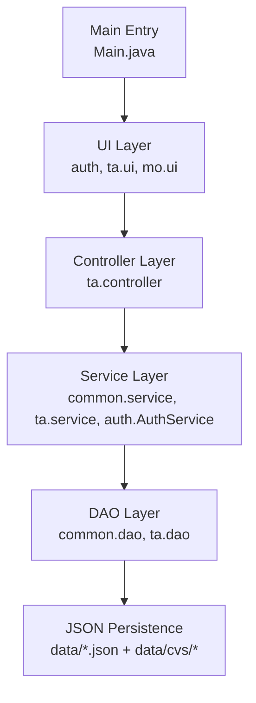
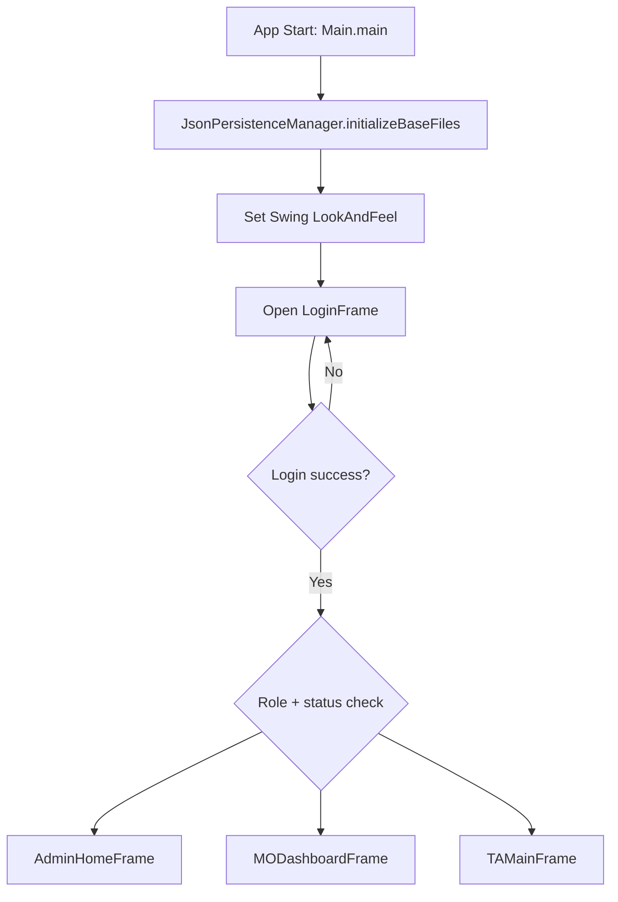
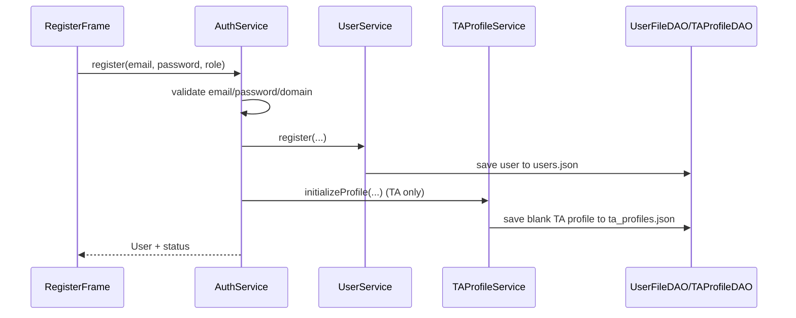
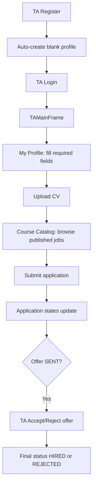
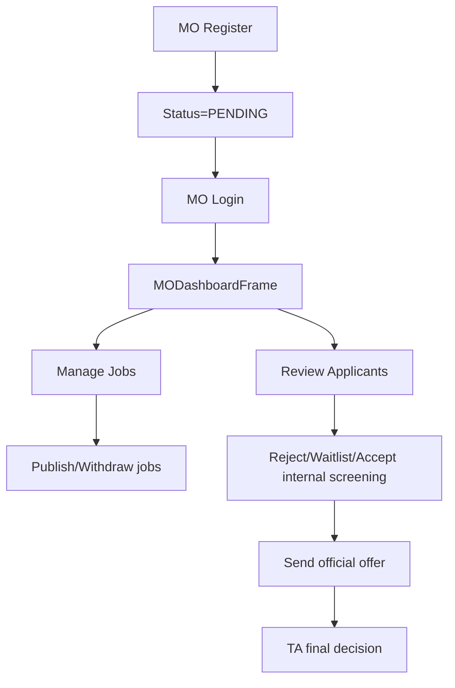
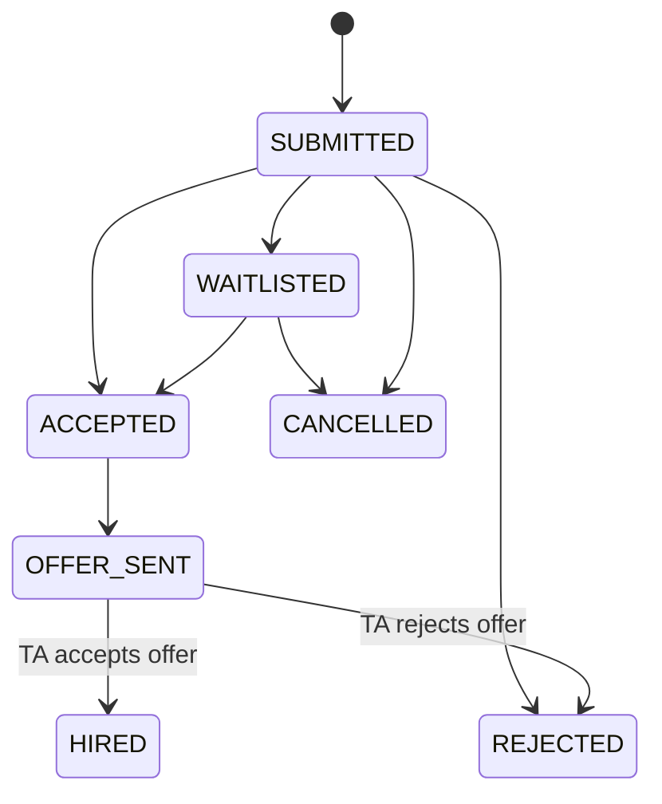
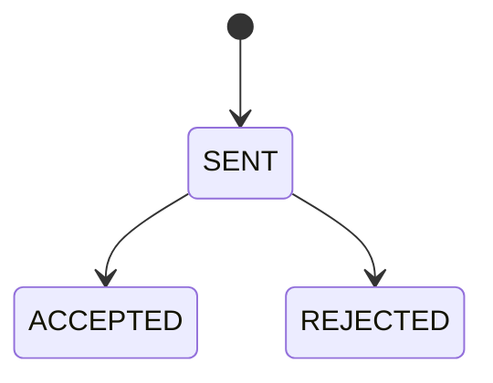

# TA Recruitment System - Project Architecture and Runtime Logic-iteration 2

## 1. System Architecture (Current Version)

### 1.1 Layered Structure

### 1.2 Package Responsibilities

- `auth`: login, registration, role-based routing, admin portal pages.
- `ta.ui` + `ta.controller` + `ta.service` + `ta.dao`: TA main workflows (profile, CV, applications, offer decisions).
- `mo.ui` + `common.service`: MO workflows (job posting, applicant review, sending offers).
- `common.service` + `common.dao`: shared services and persistence (users, jobs, offers, notifications, system config).
- `common.entity` + `ta.entity`: domain objects and state models.

### 1.3 Data Persistence Layout

All business data is persisted as JSON under `data/` (initialized by `JsonPersistenceManager`), including:

- `users.json`
- `ta_profiles.json`
- `mo_jobs.json`
- `ta_applications.json`
- `ta_cvs.json`
- `mo_offers.json`
- `notifications.json`
- `system_config.json`
- file assets under `data/cvs/`

---

## 2. Startup and Global Runtime Flow

Global runtime points:

- Application starts from `Main`.
- `LoginFrame` is the single authentication gateway.
- Route target is determined by user role and account checks:
  - `ADMIN` -> `AdminHomeFrame` (strict super-admin check).
  - `MO` -> `MODashboardFrame`.
  - `TA` -> `TAMainFrame`.

---

## 3. Registration and Login Logic

## 3.1 Registration (`RegisterFrame` -> `AuthService.register`)

Key behavior:

- Registration requires `@qmul.ac.uk` email.
- Role-based account status:
  - `MO` starts as `PENDING`.
  - `TA` and `ADMIN` start as `ACTIVE`.
- TA registration immediately initializes a blank profile in `ta_profiles.json`.

## 3.2 Login (`LoginFrame` -> `AuthService.login`)

- Validates credentials.
- Enforces role tab match (selected role must match account role).
- Blocks `DISABLED` accounts.
- Enforces strict admin rule: only active `admin@test.com` can enter Admin portal.
- Updates `lastLogin` on successful login.

---

## 4. TA Role Runtime Logic (Register -> Features)

## 4.1 TA End-to-End Flow

## 4.2 TA Main Modules (`TAMainFrame`)

- `Dashboard`: aggregate status and quick summary.
- `Course Catalog` (`TACourseCatalogPanel`):
  - loads published jobs.
  - blocks apply if profile incomplete or CV missing.
  - submits application with selected CV + statement.
- `My Applications` (`TAApplicationsPanel`):
  - view application detail and status.
  - cancel if status allows.
  - accept/reject offer when an offer is in `SENT`.
- `My Profile` (`TAProfilePanel`):
  - save required fields and profile data.
  - manage multiple CVs (upload/view/set default/delete).
- `Workload Tracking`: displays workload-related information.

## 4.3 TA Application Constraints (in `TAApplicationService`)

- Profile must be complete before applying.
- At least one CV required.
- Job must be published.
- No duplicate active application for same job.
- Cannot reapply after rejection for same job.
- Max 3 active applications at a time.

---

## 5. MO Role Runtime Logic (Register -> Features)

## 5.1 MO End-to-End Flow

## 5.2 MO Main Modules

- `MOJobManagementPanel`:
  - create/edit/withdraw jobs.
  - job deadline validation (must be parseable and within global application cycle).
  - persistence through `MOJobService` -> `MOJobDAO`.
- `MOApplicantReviewPanel`:
  - shows applications for current MO's jobs.
  - updates internal statuses (`REJECTED`, `WAITLISTED`, `ACCEPTED`).
  - sends official offers via `MOOfferService.sendOffer`.
  - after offer send, application status transitions to `OFFER_SENT`.

---

## 6. Admin Role Runtime Logic (Register/Login -> Features)

## 6.1 Admin Access Rule

- Portal is guarded by strict validation (`UserService.isStrictAdmin`):
  - must be role `ADMIN`;
  - email must be `admin@test.com`;
  - status must be `ACTIVE`.

## 6.2 Admin Portal (`AdminHomeFrame`) Functional Tabs

- `MO Account Approval`:
  - approve MO accounts (`PENDING -> ACTIVE`);
  - disable/reactivate accounts;
  - reset user password.
- `System Data`:
  - inspect users, TA profiles, jobs, applications, CV infos, offers, notifications.
  - export selected dataset to CSV.
- `Application Cycle`:
  - configure global application start/end datetime.
  - affects MO job deadline validation.

---

## 7. Core State Transitions

## 7.1 Application Status

## 7.2 Offer Status

---

## 8. Key Runtime Call Chains

### 8.1 Authentication Chain

- `LoginFrame` -> `AuthService` -> `UserService` -> `UserFileDAO` -> `users.json`

### 8.2 TA Apply Chain

- `TACourseCatalogPanel` -> `TAApplicationController` -> `TAApplicationService`
- profile gate: `TAProfileService` -> `TAProfileDAO` -> `ta_profiles.json`
- CV gate: `CVService` -> `CVDao` -> `ta_cvs.json` + `data/cvs/*`
- job gate: `MOJobService` -> `MOJobDAO` -> `mo_jobs.json`
- submit: `TAApplicationDAO` -> `ta_applications.json`

### 8.3 MO Send Offer Chain

- `MOApplicantReviewPanel` -> `MOOfferService.sendOffer` -> `MOOfferDAO` -> `mo_offers.json`
- notification: `NotificationService` -> `NotificationDAO` -> `notifications.json`

### 8.4 Admin Config Chain

- `AdminHomeFrame` -> `SystemConfigService` -> `system_config.json`
- `MOJobService` validates job deadline against configured cycle.

---

## 9. Notes on Current Implementation

- Runtime routing currently uses `MODashboardFrame` for MO, while `MOHomeFrame` remains as a legacy/demo entry.
- Persistence is file-based JSON, so running from project root is required to resolve `data/` paths correctly.
- Notifications are first-class runtime events linking TA/MO actions (offer sent, response, application updates).

